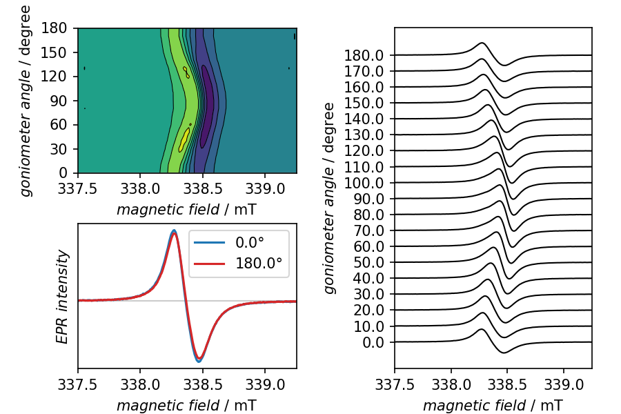

================
Rotation pattern
================

When performing angular-dependent EPR measurements, *i.e.* recording rotation patterns, it is of particular importance to have a well-crafted graphical representation that provides access to all crucial information at once. This includes different ways of displaying the rotation pattern as well as overlaying two traces recorded with an angular difference of 180°. Due to the physics underlying magnetic resonance, those two signals should be identical (at least in shape), and if not, this is a good hint that something went wrong.

The cwepr package provides a special plotter, the :class:`cwepr.plotting.GoniometerSweepPlotter`, particularly designed for this purpose. Therefore, getting an overview of an angular-dependent measurement is a matter of only a single plotting operation, only preceded by a baseline correction.

Recipe
======

.. literalinclude:: ../../examples/rotation-pattern/rotation-pattern.yaml
    :language: yaml
    :linenos:
    :caption: Complete recipe for getting a first overview of an angular-dependent cw-EPR measurement, i.e. a rotation pattern. In this case, only a baseline correction is performed, no frequency correction, as spectra are primarily compared within one measurement. If you would like to compare different rotation patterns, consider adding a frequency correction as well.

Result
======

    **Overview of an angular-dependent cw-EPR measurement (rotation pattern).** The panels top-left and right provide different views on the entire rotation pattern, each highlighting certain characteristics of the dataset. The panel bottom-left compares the traces obtained with 180° different angle. They should be identical, at least in shape. Sometimes, as in this example, the intensity does slightly vary, though.
